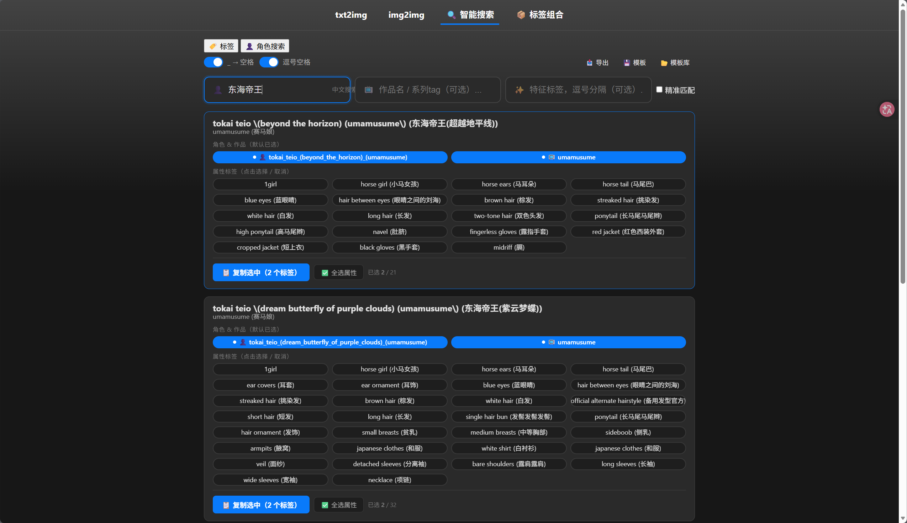
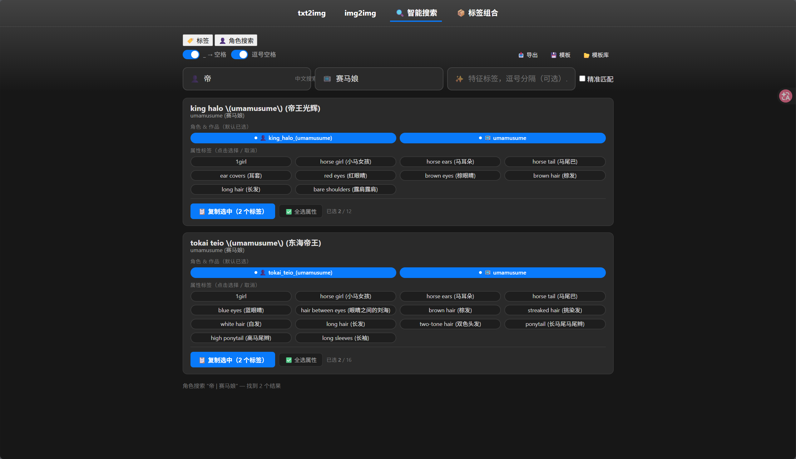

# sd-webui-prompt-all-in-one-app (AI 增强版)

[](https://github.com/buxiangyaohaoming/sd-webui-prompt-all-in-one-app-bxyhm/blob/main/LICENSE)

<div align="center">

### [🇺🇸 English](README.MD) | [🇨🇳 简体中文](README_CN.MD)

</div>

> **⚠️ 本项目代码（包括新增功能、翻译数据修复、文档）均由 AI（Claude）生成。**
>
> 基于 [Physton/sd-webui-prompt-all-in-one-app](https://github.com/Physton/sd-webui-prompt-all-in-one-app) 进行 Fork 并增强。

---

本项目是 [sd-webui-prompt-all-in-one](https://github.com/physton/sd-webui-prompt-all-in-one) 的独立版本，无需依赖 [stable-diffusion-webui](https://github.com/AUTOMATIC1111/stable-diffusion-webui)，即可在浏览器中编写和管理 Stable Diffusion 提示词（Prompt）。

相比原版，此 Fork 增加了以下 AI 辅助开发的功能和修复。

---

## ✨ 新增功能

### 🔍 角色名搜索

在左侧标签列表中直接搜索角色名称，自动补全并显示关联标签。



### 📺 系列分类浏览

按系列（如 偶像大师、赛马娘、东方 Project 等）浏览角色，方便快速定位。



### 🏷️ 标签搜索与统一搜索

- **标签搜索**：支持中英文模糊搜索 Danbooru 标签
- **统一搜索**：同时搜索标签、角色、组合，一键添加

### 🧩 Tag 组合管理

- **组合预设**：保存常用的 Prompt 标签组合，快速复用
- **组合管理**：创建、编辑、删除自定义标签组合(目前没有完善)

### 📝 中文化翻译大幅增强

- 修复了 **14 万+** Danbooru 标签的中文翻译
- 重点修正了 **偶像大师**（偶像大师）、**赛马娘**（Uma Musume）、**东方 Project** 系列角色译名
- 翻译来源以萌娘百科权威译名为准，置信度达 95%+
- CSV 翻译文件（`danbooru.zh_CN.csv`）覆盖 14 万+ 条目

---

## 📥 下载与运行

### 方式一：git clone（推荐）

```bash
git clone https://github.com/buxiangyaohaoming/sd-webui-prompt-all-in-one-app-bxyhm.git --recurse-submodules
cd sd-webui-prompt-all-in-one-app-bxyhm
pip install -r requirements.txt
python app.py
```

> 中国大陆用户如遇网络问题，可使用镜像源：
> ```bash
> pip install -r requirements.txt -i https://pypi.mirrors.ustc.edu.cn/simple
> ```

### 方式二：下载 ZIP

前往 [Releases](https://github.com/buxiangyaohaoming/sd-webui-prompt-all-in-one-app-bxyhm/releases) 下载最新版压缩包，解压后运行：

```bash
pip install -r requirements.txt
python app.py
```

### 运行后

浏览器访问 [http://localhost:17860](http://localhost:17860)

如需修改端口、用户名、密码，复制 `.env.example` 为 `.env` 后编辑。

---

## 🐳 Docker 运行

```bash
docker run -d \
  -p 17860:17860 \
  -e APP_PORT=17860 \
  -e APP_USERNAME=admin \
  -e APP_PASSWORD= \
  --name sd-webui-prompt-all-in-one-app \
  buxiangyaohaoming/sd-webui-prompt-all-in-one-app-bxyhm
```

---

## 📂 项目结构

```
sd-webui-prompt-all-in-one-app/
├── app.py                       # 主应用入口
├── launch.py                    # 启动器
├── install.py                   # 初始化安装
├── requirements.txt             # Python 依赖
├── danbooru.zh_CN.csv           # Danbooru 标签中文化翻译（14万+条）
├── characters.txt               # 角色标签定义
├── fix_touhou_translations.py   # 翻译修复工具
├── static/
│   ├── js/
│   │   ├── character-search.js  # 角色搜索
│   │   ├── tag-search.js        # 标签搜索
│   │   ├── unified-search.js    # 统一搜索
│   │   ├── combo-manager.js     # 组合管理
│   │   ├── combo-presets.js     # 组合预设
│   │   └── autocomplete.js      # 自动补全
│   └── css/
│       └── tag-search.css       # 搜索样式
└── modules/                     # SD WebUI 模块适配
```

---

## ⚙️ 环境变量

| 参数 | 说明 | 默认值 |
|:---|:---|:---|
| `APP_PORT` | 服务端口 | `17860` |
| `APP_USERNAME` | 用户名 | `admin` |
| `APP_PASSWORD` | 密码 | 空（无需密码） |

---

## 🙏 致谢

- 原始项目：[Physton/sd-webui-prompt-all-in-one-app](https://github.com/Physton/sd-webui-prompt-all-in-one-app)
- 标签数据来源：[Danbooru](https://danbooru.donmai.us/)
- 翻译参考：[萌娘百科](https://zh.moegirl.org.cn/)

---

> 🤖 本项目所有代码（包括新增功能模块、中文化翻译修复、文档）均由 AI（Claude）在用户指导下生成，并已通过实际运行验证。
